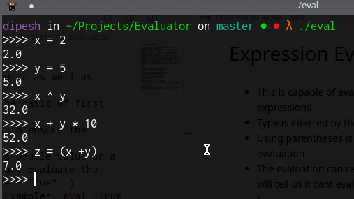
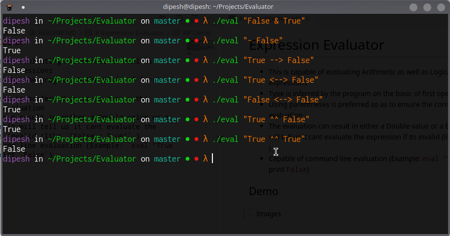
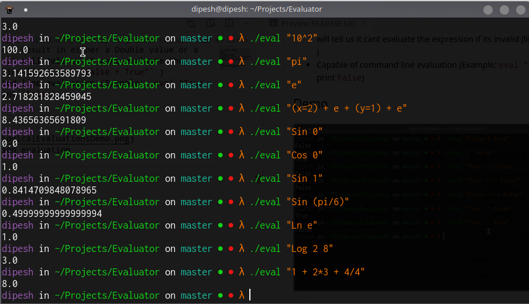
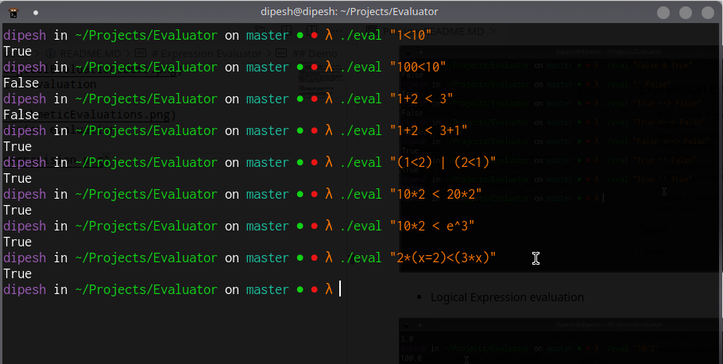

# Expression Evaluator

* This is capable of evaluating Arithmetic as well as Logical (Boolean) expressions
* Type is inferred by the program on the basic of first operation
* Using parentheses is preferred so as to ensure the correct order of evaluation
* The evaluation can result in either a Double value or a Boolean value. Or it will tell us it cant evaluate the expression if its invalid (like `"False + True"` )
* Capable of command line evaluation (Example: `eval "True & False ` will print `False`)
* Running the program without providing any arguments will start up a `REPL`

## Demo

* REPL


* Logical Expression evaluation

 
* Arithmetic Expression evaluation


* Comparisions 

## Operations
* `+`
* `-`
* `*`
* `/`
* `%`  -> will do float mod
* `^`  -> power
* `&` -> Logical And
* `|` -> Logical Or
* `~` -> Logical Not
* `-->` -> Logical Implies
* `<-->` -> Logical Double Implies
* `^^` -> Logical Xor
* `<` 
* `<=`
* `>` 
* `>=`
* `==`
* `!=`
* `Sin`
* `Cos`
* `Tan`
* `Log` followed by logbase and and number
* `Ln` -> Natural Log


## Note

* There could still be a problem with associativity of Arithmetic operators `+` and `-`. It is hence advised to parenthesize everything properly in those operations. I have tried it with almost 8 operation long expression and it did match with python evaluation for the same expression. But I havent been able to prove it correctness formally so I would still advise using parens.
* The comparision operator will give  `False` for `True < False` and `True` for otherway around. This is because it is defined like that in Haskell. 
```
>>> True < False
False
>>> True > False
True
>>> True == False
False
>>> True == True
True
```
* if you assign different type of values to a variable as in
```
x=2
x= True
```
In this case it will always be evaluated to the boolean value implying booleans values are checked first in the symbol table. Because of this , it is advised to preserve the initial type of the variable


## Requirements to run the program
* `Glasgow Haskell Compiler` or `ghc` must be installed 

## Compilation
* Run `ghc eval.hs` 
* This will produce a binary `eval` and you can run it locally with `./eval` 
